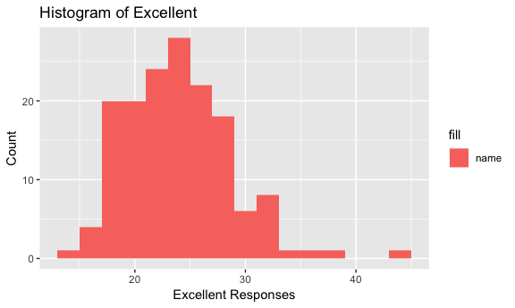

p8105\_hw2\_qg2155
================
Qiu Xia (Helen) Guan
9/28/2018

Problem 1
=========

### Import and clean subway dataset

``` r
subway_data =
  read_csv(file = "./data/NYC_Transit_Subway_Entrance_And_Exit_Data.csv") %>%
  janitor::clean_names() %>% 
  select(line:entry, vending, ada) %>% 
  mutate(entry = recode(entry, "YES" = TRUE, "NO" = FALSE)) 
```

This dataset has 19 columns and 1868 rows. The variables are line, station names, station latitude and longitude, routes served, entry, vending, entrance type, and ADA compliance. The data cleaning steps so far has been transforming column names into lower case and snake form with the clean\_names function, creating dataset with just the necessary variables with the select function, and recoding "entry" from character to a logical variable that shows TRUE for yes and FALSE for no. This dataset is not yet tidy because station names are not distinct.

### Answering questions with data based off distinct stations

``` r
subway_data_distinct = 
  distinct(subway_data, station_name, line, .keep_all = TRUE)
```

-   There are a total of 465 distinct stations.
-   The number of stations that are ADA compliant are 84.
-   The proportion of station entrances / exists without vending that allows entrance is 0.0107527.

### Reformat data to learn about A train

``` r
subway_distinct =
  gather(subway_data_distinct, key = route_number, value = route_name, route1:route11) 
```

Out of the distinct subway stations, there are 60 who serve the A train. Within those stations, 17 are ADA compliant.

Problem 2
=========

### Import and clean trash dataset

``` r
mrtrash_data =
  readxl::read_excel(path = "./data/HealthyHarborWaterWheelTotals2018-7-28.xlsx",
                     sheet = "Mr. Trash Wheel", range = "A2:N336") %>% 
  janitor::clean_names() %>% 
  na.omit(mrtrash_data$dumpster) %>% 
  mutate(sports_balls = as.integer(round(sports_balls, 0)))
```

### Import and clean precipitation datasets from 2016 and 2017

``` r
precip_2016 = 
  readxl::read_excel(path = "./data/HealthyHarborWaterWheelTotals2018-7-28.xlsx",
                             sheet = "2016 Precipitation", range = "A2:B14") %>% 
  janitor::clean_names() %>% 
  mutate(year = 2016)
```

``` r
precip_2017 =
  readxl::read_excel(path = "./data/HealthyHarborWaterWheelTotals2018-7-28.xlsx",
                             sheet = "2017 Precipitation", range = "A2:B14") %>% 
  janitor::clean_names() %>% 
  mutate(year = 2017)
```

### Combining precipatation data from years 2016 and 2017

``` r
precip_combined = 
  bind_rows(precip_2016, precip_2017) %>% 
  mutate(month = month.name[month])
```

The Mr.Trash Wheel dataset has 14 variables and 285 observations. It has variables dumpster, month, year, date, weight in tons, volumne in cubic yards, homes powered and variables for trash such as plastic bottles, polystyrene, cigarette butts, glass bottles, grocery bags, chip bags, and sports balls. The precipitation dataset has 3 variables and 24 observations. It has variables month, total, and year.

-   The total precipitation in 2017 was 32.93.

-   The median number of sports balls in a dumpster in 2016 was 26.

Problem 3
=========

### Load dataset into R

``` r
devtools::install_github("p8105/p8105.datasets")
```

    ## Skipping install of 'p8105.datasets' from a github remote, the SHA1 (21f5ad1c) has not changed since last install.
    ##   Use `force = TRUE` to force installation

``` r
library(p8105.datasets)
data(brfss_smart2010)
```

### Clean the dataset

``` r
brfss_data = 
  janitor::clean_names(brfss_smart2010) %>% 
  filter(topic == "Overall Health") %>% 
  select(-class, -topic, -question, -sample_size, -(confidence_limit_low:geo_location)) %>% 
  spread(key = response, value = data_value) %>% 
  janitor::clean_names() %>% 
  mutate(excellent_verygood = excellent + very_good)
```

### Answer the questions

Create new dataset for distinct locations

``` r
locations_distinct = brfss_data %>% 
  distinct(brfss_data, locationdesc, .keep_all = TRUE)
```

Create new dataset for distinct states

``` r
states_distinct = brfss_data %>% 
  distinct(brfss_data, locationabbr, .keep_all = TRUE)
```

-   This dataset has 404 unique locations.
-   This dataset has all the states including DC because there are 51 states entered. The state that is observed the most is NJ.
-   In 2002, the median of the "Excellent" response value was 23.6.

### To create a histogram of Excellent responses for year 2002

``` r
brfss_data_histogram = brfss_data %>%
  filter(year == 2002)
```

``` r
ggplot(brfss_data_histogram, aes(x = excellent, fill = "name")) +
  geom_histogram(binwidth = 2) +
  labs(
    title = "Histogram of Excellent",
    x = "Excellent Responses",
    y = "Count"
  )
```

    ## Warning: Removed 2 rows containing non-finite values (stat_bin).



### To create a scatterplot of Excellent responses in NY Country and Queesn Country in each year from 2002 to 2010

``` r
brfss_data_graph = brfss_data %>% 
  filter(locationdesc == "NY - Queens County" | locationdesc == "NY - New York County") 
```

``` r
ggplot(brfss_data_graph, aes(x = year, y = excellent)) +
  geom_point(aes(color = locationdesc), alpha = .5) +
  labs(
  title = "Excellent plot",
  x = "Year",
  y = "Proportion of responses with excellent"
  )
```


